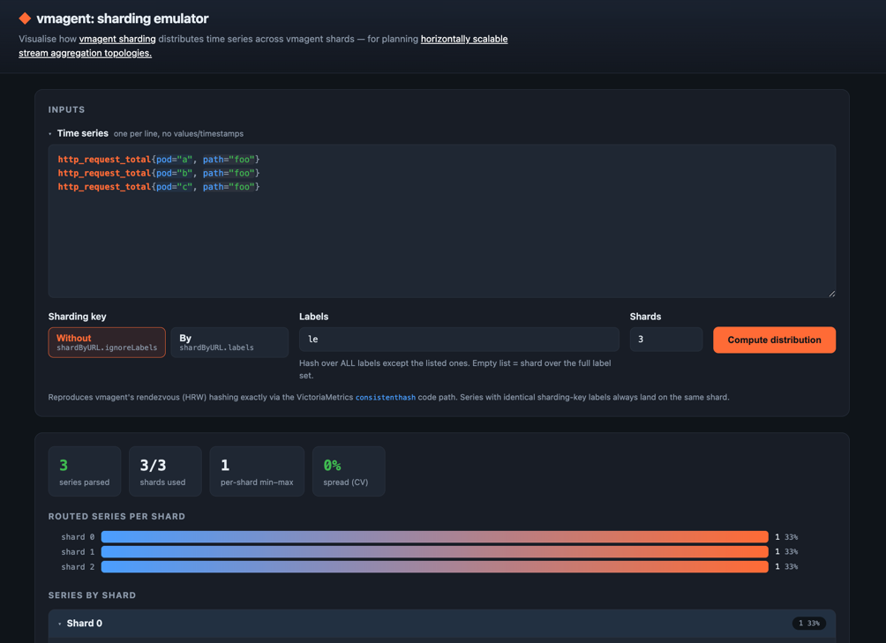
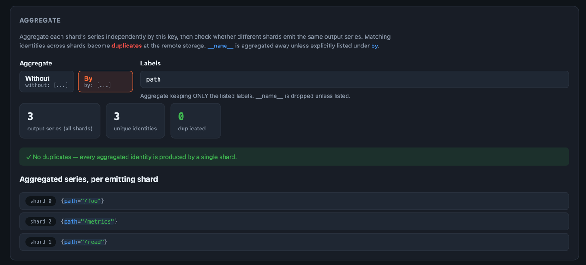

# vmagent: sharding emulator

A small web tool to visualise how vmagent's `-remoteWrite.shardByURL` distributes
time series across shards. Useful for planning horizontally scalable stream
aggregation topologies, confirming a sharding key spreads series evenly and
keeps logically-grouped series (e.g. all `le` buckets of one histogram) together
on a single shard.

> Disclaimer: this project was created with AI assistance.

## Run

```bash
make run
```

Open the URL, paste time series one per line, no values/timestamps. For example:
```
http_request_total{pod="a", path="foo"}
http_request_total{pod="b", path="foo"}
http_request_total{pod="c", path="foo"}
```

Choose the sharding key (`Without` => `shardByURL.ignoreLabels`, `By` => `shardByURL.labels`),
set the shard count, and read off the distribution.



The shard assignment is computed with VictoriaMetrics' **exact** code path:

- `consistenthash.ConsistentHash` — rendezvous / highest-random-weight selection **imported directly** from
  [github.com/VictoriaMetrics/VictoriaMetrics/lib/consistenthash](https://github.com/VictoriaMetrics/VictoriaMetrics/tree/master/lib/consistenthash)
- `getLabelsHashForShard` — concatenates `name+value` per label with **no
  separators** and hashes with XXH64; it uses the same `github.com/cespare/xxhash/v2` version vmagent pins.
- Labels are hashed in the order written, with `__name__` first.
  This matches vmagent's default (it does not sort labels unless `-sortLabels` is
  set), so `m{a,b}` and `m{b,a}` may hash differently — as they would in vmagent.

In section `Aggregate` specify which labels you want to use to aggregate series after the sharding.
For example, if you have 3 vmagent shards with stream aggregation enabled and aggregation rules contain `by: cluster`,
then specify `by: cluster` in the section settings. It will apply this aggregation to series within shards and will
check if there are any duplicates after the aggregation. 

> Duplicates would mean that at least two distinct aggregation shards produced series with identical labels that
> will later collide in the remote time series database.

